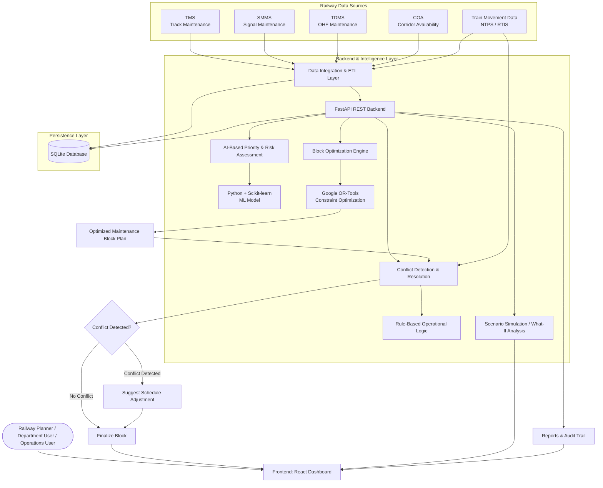

# 🚆 RailBlock AI - AI-Powered Automatic Railway Block Planning System

## 🌐 Project Overview

<div align="center">

## ✨ AI-POWERED AUTOMATIC BLOCK PLANNING ✨

### Maximizing Asset Availability for Train Operations on Indian Railways

**Smart India Hackathon 2026 | SIH-26027**

### 👥 Team HungryNerds

</div>

[](https://www.python.org/)
[](https://fastapi.tiangolo.com/)
[](https://react.dev/)
[](https://developers.google.com/optimization)
[](https://scikit-learn.org/)
[](https://www.sqlalchemy.org/)
[](https://www.sqlite.org/)
[](https://restfulapi.net/)
[](https://numpy.org/)
[](https://pandas.pydata.org/)

**RailBlock AI** is an AI-powered intelligent railway maintenance block planning platform engineered to maximize asset availability for train operations on Indian Railways.

The system integrates maintenance data from multiple railway departments, intelligently prioritizes maintenance tasks, automatically combines compatible works into optimized maintenance blocks, detects conflicts with train movements, and provides operational recommendations through an interactive dashboard.

---

## 📌 Problem Statement

Indian Railways performs maintenance activities across multiple departments such as Track, Signal & Telecommunication (S&T), and OHE. These activities often require railway blocks that temporarily restrict train operations.

When different departments independently plan their maintenance activities, compatible works may be scheduled separately, resulting in:

- Unnecessary duplication of railway blocks.
- Reduced availability of railway assets.
- Increased maintenance downtime.
- Conflicts between maintenance activities and train schedules.
- Increased operational workload for railway planners.
- Difficulty coordinating maintenance activities across departments.
- Limited visibility of real-time operational conflicts.

**SIH-26027** focuses on building an **AI-Powered Automatic Block Planning system to maximize asset availability for train operations on Indian Railways**.

RailBlock AI resolves this by combining **multi-source railway data integration**, **AI-based priority assessment**, **constraint-based optimization**, **real-time conflict detection**, **scenario analysis**, and **role-based dashboards** into a unified planning platform.

---

## 🏛️ System Architecture



---

## 💻 Complete Technology Stack & Dependencies

### Frontend Ecosystem:

- **Core Framework**: React
- **UI Dashboard**: Interactive railway planning dashboard
- **Visualization**: Interactive schedules, timelines, alerts and analytics
- **API Communication**: REST API
- **Role-Based Interface**: Planner, Department User and Operations User dashboards

### Backend Ecosystem:

- **Framework**: FastAPI
- **Language**: Python
- **API Architecture**: RESTful JSON APIs
- **Data Processing**: Pandas / NumPy
- **Machine Learning**: Scikit-learn
- **Optimization**: Google OR-Tools
- **ORM**: SQLAlchemy
- **ETL**: Python-based data ingestion and transformation

### Database:

- **RDBMS**: SQLite
- **ORM**: SQLAlchemy
- **Storage**:
  - Maintenance tasks
  - Railway sections
  - Train movements
  - Maintenance blocks
  - Conflict records
  - Operational alerts
  - Planning results

### AI / Optimization:

- **Priority Assessment**: Python + Scikit-learn + Rule-Based Logic
- **Block Optimization**: Google OR-Tools
- **Constraint Solver**: CP-SAT
- **Conflict Detection**: Rule-Based Validation Engine
- **Scenario Analysis**: Python-based What-If Simulation

---

## ✨ Key Feature Modules

### 1. **Multi-Source Railway Data Integration**

The platform provides a unified planning layer for integrating data from multiple railway systems:

- **TMS** — Track Management System
- **SMMS** — Signal Maintenance Management System
- **TDMS** — OHE / Electrical Maintenance System
- **COA** — Corridor Availability
- **Train Movement Data** — NTPS / RTIS-style operational data

The integrated data provides planners with a consolidated view of maintenance requirements and train operations.

---

### 2. **AI-Based Priority & Risk Assessment**

The system evaluates maintenance tasks based on multiple factors:

- Asset criticality
- Defect severity
- Overdue status
- Maintenance urgency
- Operational impact
- Department
- Section

The priority engine produces an explainable priority score that helps determine which maintenance tasks should be scheduled first.

```text
Maintenance Task
       ↓
Defect Analysis
       ↓
Asset Criticality
       ↓
Overdue Status
       ↓
Operational Impact
       ↓
Priority / Risk Score
```

---

### 3. **Automatic Block Optimization**

The core optimization engine uses **Google OR-Tools** to automatically identify compatible maintenance works and combine them into optimized railway blocks.

The optimization considers:

- Department compatibility
- Railway section
- Maintenance duration
- Available time windows
- Operational constraints
- Train schedules
- Minimum block count
- Maintenance requirements

```text
Multiple Maintenance Requests
            ↓
     Compatibility Check
            ↓
    Constraint Generation
            ↓
    Google OR-Tools CP-SAT
            ↓
   Optimized Block Schedule
```

This reduces unnecessary duplicate blocks while maximizing the availability of railway assets for train operations.

---

### 4. **Live Conflict Detection & Resolution**

Planned maintenance blocks are checked against train schedules and operational conditions.

The system detects:

- Train approaching maintenance block
- High-priority train movement
- Schedule conflicts
- Insufficient operational gap
- Block timing conflicts
- Section availability conflicts

When a conflict is detected, the system can suggest an alternative maintenance window or operational adjustment.

```text
Optimized Block
       ↓
Train Schedule Check
       ↓
Operational Constraint Check
       ↓
     Conflict?
      /     \
    NO       YES
    ↓         ↓
Finalize   Suggest Adjustment
```

---

### 5. **Scenario Simulation & What-If Analysis**

The platform supports scenario-based planning to evaluate alternative maintenance schedules.

Planners can compare:

- Current planning scenario
- Optimized planning scenario
- Different maintenance windows
- Different train conditions
- Alternative block combinations

This helps planners understand the operational impact before finalizing a maintenance plan.

---

### 6. **Role-Based Dashboard**

The system provides dedicated views for different railway stakeholders.

#### 🧑‍💼 Planner

- View maintenance requirements
- Run optimization
- Review recommended blocks
- Analyze conflicts
- Generate maintenance plans

#### 🛠️ Department User

- Upload / synchronize maintenance data
- View department tasks
- Track maintenance requirements
- Review planned blocks

#### 🚆 Operations User

- View train schedules
- Monitor corridor availability
- Monitor live operational conditions
- Review conflicts and alerts

---

### 7. **Real-Time Alerts & Notifications**

The platform generates operational alerts for important events.

Examples:

```text
⚠️ Maintenance block approaching train movement

🚨 High-priority train detected

🔄 Schedule adjustment recommended

⏸️ Maintenance block requires intervention

✅ Section cleared

📊 Optimized block plan generated
```

---

### 8. **Maintenance Reports & Audit Trail**

The system maintains planning results and operational information for transparency and analysis.

Reports can include:

- Asset availability
- Number of maintenance blocks
- Block reduction
- Maintenance efficiency
- Conflicts detected
- Conflict resolutions
- Department-wise maintenance
- Planning history

---

## 📊 Optimization Workflow

```text
┌─────────────────────────────┐
│   Railway Data Sources      │
│ TMS | SMMS | TDMS | COA    │
│      Train Movement Data    │
└──────────────┬──────────────┘
               ↓
┌─────────────────────────────┐
│     Data Integration        │
│        & ETL Layer          │
└──────────────┬──────────────┘
               ↓
┌─────────────────────────────┐
│ AI Priority & Risk          │
│ Assessment                  │
└──────────────┬──────────────┘
               ↓
┌─────────────────────────────┐
│ Block Optimization Engine   │
│       Google OR-Tools       │
└──────────────┬──────────────┘
               ↓
┌─────────────────────────────┐
│ Optimized Maintenance       │
│ Block Plan                  │
└──────────────┬──────────────┘
               ↓
┌─────────────────────────────┐
│ Conflict Detection          │
│ Against Train Schedule      │
└──────────────┬──────────────┘
               ↓
        ┌──────┴──────┐
        ↓             ↓
   No Conflict     Conflict
        ↓             ↓
   Finalize       Adjustment
        └──────┬──────┘
               ↓
┌─────────────────────────────┐
│ Dashboard + Alerts +        │
│ Reports & Audit Trail       │
└─────────────────────────────┘
```

---

## 🚀 Quick Setup & Installation Guide

### Prerequisites

- **Python**: 3.x or higher
- **Node.js**: 18.0 or higher
- **npm**: Latest stable version
- **Git**: Latest version
- **pip**: Latest version

---

### Step 1: Clone the Repository

```bash
git clone https://github.com/YOUR_USERNAME/SIH-26027_Automatic-Block-Planning_HungryNerds.git

cd SIH-26027_Automatic-Block-Planning_HungryNerds
```

---

### Step 2: Create Python Virtual Environment

#### Windows

```powershell
python -m venv venv

venv\Scripts\activate
```

#### Linux / macOS

```bash
python3 -m venv venv

source venv/bin/activate
```

---

### Step 3: Install Backend Dependencies

```bash
cd backend

pip install -r requirements.txt
```

The main dependencies include:

```text
fastapi
uvicorn
sqlalchemy
scikit-learn
ortools
pandas
numpy
```

---

### Step 4: Start Backend

```bash
uvicorn main:app --reload
```

The FastAPI backend will start on:

```text
http://localhost:8000
```

### API Documentation

FastAPI provides interactive API documentation at:

```text
http://localhost:8000/docs
```

---

### Step 5: Install Frontend Dependencies

Open another terminal:

```powershell
cd frontend

npm install
```

---

### Step 6: Start React Frontend

```bash
npm run dev
```

The React frontend will start on:

```text
http://localhost:5173
```

---

## 📡 REST API Endpoint Reference

| Method | Endpoint | Description | Sample Request Body |
|---|---|---|---|
| `GET` | `/` | Backend health check | *None* |
| `GET` | `/tasks` | Fetch maintenance tasks | *None* |
| `GET` | `/trains` | Fetch train movement data | *None* |
| `GET` | `/blocks` | Fetch planned maintenance blocks | *None* |
| `POST` | `/optimize` | Generate optimized maintenance blocks | `{}` |
| `POST` | `/conflicts` | Detect train/block conflicts | `{}` |
| `POST` | `/reset` | Reset demonstration scenario | `{}` |
| `GET` | `/alerts` | Fetch operational alerts | *None* |
| `GET` | `/reports` | Generate planning reports | *None* |
| `POST` | `/scenario` | Run what-if scenario analysis | `{}` |

> Endpoint names may vary depending on the current backend implementation.

---

## 🎬 Live Demo Presentation Script

Follow this workflow during the Smart India Hackathon demonstration.

---

### 1. Demonstrate Multi-Department Maintenance Data

Open the dashboard and show maintenance requirements from different departments:

```text
🛤️ Track
🚦 Signal & Telecommunication
⚡ OHE
```

### Key Talking Point:

> "Our system brings maintenance requirements from multiple departments into a unified planning environment instead of treating each department's work independently."

---

### 2. Demonstrate AI-Based Priority Assessment

Open the maintenance task view and display the priority assessment.

Show factors such as:

```text
Asset Criticality
Defect Severity
Overdue Status
Operational Impact
```

### Key Talking Point:

> "The priority engine evaluates the operational importance and urgency of each maintenance task, allowing critical work to be prioritized before optimization."

---

### 3. Demonstrate Automatic Block Optimization

Click:

```text
⚙️ RUN OPTIMIZATION
```

The system processes compatible maintenance activities.

```text
Track Work
     +
Signal Work
     +
OHE Work
     ↓
Compatibility Analysis
     ↓
OR-Tools Optimization
     ↓
Combined Maintenance Block
```

### Key Talking Point:

> "Instead of creating separate blocks for compatible maintenance activities, our optimization engine combines them into a feasible maintenance block, reducing unnecessary blocks and increasing asset availability."

---

### 4. Demonstrate Live Conflict Detection

Open the conflict monitoring section.

The system compares:

```text
Maintenance Block
        +
Train Schedule
        +
Operational Constraints
```

The system identifies whether the planned block conflicts with train operations.

### Key Talking Point:

> "Before finalizing a block, the system validates it against train movements and operational constraints. If a conflict is detected, the system suggests an appropriate adjustment."

---

### 5. Demonstrate Dashboard, Alerts & Reports

Show:

```text
📊 Dashboard
🚨 Alerts
🧱 Block Plan
🚆 Train Schedule
📈 Analytics
📄 Reports
```

### Key Talking Point:

> "The dashboard provides planners, department users and operations users with role-based visibility into maintenance planning, train operations, conflicts and optimization results."

---

## 📈 Impact & Benefits

### 1. **Improved Asset Availability**

**Impact:** Optimal block planning by merging compatible maintenance works across departments.

**Benefit:**

- Fewer maintenance blocks
- More time available for train operations
- Better utilization of railway assets

---

### 2. **Operational Efficiency**

**Impact:** Automated planning and real-time conflict detection with train schedules.

**Benefit:**

- Faster decision-making
- Coordinated multi-department scheduling
- Reduced manual planning effort
- Improved operational coordination

---

### 3. **Cost Optimization**

**Impact:** Combining compatible maintenance activities reduces duplicate blocks and unnecessary maintenance downtime.

**Benefit:**

- Reduced operational costs
- Better resource utilization
- Reduced duplicate maintenance windows
- Improved return on operational resources

---

### 4. **Scalability & Future Readiness**

**Impact:** Modular architecture designed to integrate multiple railway data sources.

**Benefit:**

- TMS integration
- SMMS integration
- TDMS integration
- COA integration
- Train movement integration
- Future AI / analytics enhancements

---

## 🌟 Unique Special Points

- 🤖 AI-driven maintenance priority assessment.
- 🔗 Multi-source railway data integration.
- 🛠️ Integrated planning across Track, Signal and OHE departments.
- ⚙️ Constraint-based block optimization using Google OR-Tools.
- 🚨 Real-time train/block conflict detection.
- 🔄 Automated rescheduling suggestions.
- 📊 Interactive dashboard with schedules and alerts.
- 🧪 Scenario-based What-If analysis.
- 📈 Asset availability and efficiency reports.
- 🧾 Planning history and audit trail.
- 🏗️ Modular architecture designed for future railway-system integration.

---

## 🏗️ Feasibility & Viability

### Technical Feasibility

The solution uses reliable and established technologies:

```text
Python
FastAPI
React
Scikit-learn
Google OR-Tools
SQLAlchemy
SQLite
```

These technologies support AI-based priority assessment, constraint optimization, data integration, conflict detection and interactive visualization.

---

### Operational Feasibility

The platform can be designed to integrate with existing railway data systems through:

```text
REST APIs
ETL Pipelines
Data Validation
Secure Data Integration
```

Role-based dashboards provide customized views for planners, department users and operations users.

---

### Economic Feasibility

The prototype uses open-source technologies, reducing initial software licensing costs.

Long-term benefits can result from:

- Reduction in unnecessary blocks
- Better asset utilization
- Improved maintenance coordination
- Reduced operational inefficiency
- Better planning decisions

---

## ⚠️ Potential Challenges, Risks & Overcomings

### Technical Challenges

**Challenge:** Integrating data from TMS, SMMS, TDMS, COA and train movement systems.

**Solution:**

- Standardized data formats
- Robust ETL pipelines
- Data validation
- Modular integration architecture
- Scalable backend services

---

### Operational Challenges

**Challenge:** Adoption across multiple railway departments and changes to existing planning processes.

**Solution:**

- Role-based dashboards
- Simple user interface
- Department-specific workflows
- Training and stakeholder involvement

---

### Data Challenges

**Challenge:** Data inconsistency, missing values and differences between department systems.

**Solution:**

```text
Data Ingestion
      ↓
Validation
      ↓
Transformation
      ↓
Normalization
      ↓
Central Planning Layer
```

---

### Economic Challenges

**Challenge:** Initial system integration and deployment costs.

**Solution:**

- Phased implementation
- Open-source technology stack
- Modular architecture
- Continuous KPI monitoring
- Gradual integration with railway systems

---

## 🧪 Prototype Data

The current prototype is designed for demonstration and development purposes.

The system can operate using simulated / synthetic railway datasets representing:

```text
TMS
SMMS
TDMS
COA
Train Movement Data
```

The prototype does **not** represent actual live Indian Railways operational control.

A production implementation would require authorized access to real railway systems and operational data.

---

## 🔮 Future Enhancements

### 🤖 Advanced Predictive Maintenance

Future versions can use historical maintenance and asset data to predict:

```text
Asset Failure Probability
Maintenance Priority
Asset Health
Failure Risk
Remaining Useful Life
```

---

### 📡 Real-Time Train Data Integration

The system can integrate real-time train movement information.

```text
Real-Time Train Data
        ↓
Streaming / API Layer
        ↓
Conflict Detection
        ↓
Dynamic Optimization
        ↓
Updated Block Plan
```

---

### 🗺️ Interactive Railway Map

Future versions can provide a live railway map showing:

```text
🚆 Train Locations
🛤️ Railway Sections
🧱 Maintenance Blocks
🚨 Conflicts
⚠️ Alerts
📊 Asset Health
```

---

### 🧠 AI + Optimization Hybrid System

A future production architecture can combine machine learning with constraint optimization:

```text
Historical Railway Data
          ↓
     ML Prediction
          ↓
Maintenance Priority
          ↓
  Google OR-Tools
          ↓
Optimized Block Plan
          ↓
 Conflict Detection
          ↓
Dynamic Rescheduling
```

---

### ☁️ Cloud Deployment

The system can be extended to cloud infrastructure for:

- Distributed data processing
- High availability
- Real-time event streaming
- Centralized monitoring
- Scalable AI services
- Secure API integration

---

## 📚 Research & References

The project research includes resources related to:

- Indian Railways Train Time Table — Data.gov.in
- Indian Railways Official Website
- Integrated Train Scheduling & Preventive Maintenance
- Train Timetable & Track Maintenance Scheduling
- Joint Train Scheduling and Maintenance Planning
- Integrated Train Timetabling and Maintenance Scheduling
- Railway Maintenance Scheduling with Hindrance & Capacity Constraints
- Indian Railways Year Book 2023–24

---

## 👥 Contributors & Team

<div align="center">

### 🚆 HungryNerds

**Smart India Hackathon 2026**

**Problem Statement ID: SIH-26027**

**AI-Powered Automatic Block Planning to Maximize Asset Availability for Train Operations on Indian Railways**

### 🇮🇳 Building Smarter & Safer Railway Operations

</div>

---

## 📄 License

This project is developed as a **Smart India Hackathon 2026 prototype** by Team HungryNerds.

---

<div align="center">

# 🚆 Fewer Blocks. Better Planning. Greater Asset Availability.

### Made with ❤️ by HungryNerds

</div>
